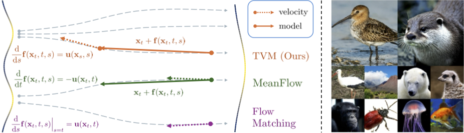

# Terminal Velocity Matching


Official Implementation of [Terminal Velocity Matching](https://arxiv.org/abs/2511.19797)

<p align="center"> 
   
</p>

<div align="center">
  <span class="author-block">
    <a href="https://alexzhou907.github.io/">Linqi Zhou</a>,</span> 
  <span class="author-block">
    <a href="https://dabeschte.github.io/">Mathias Parger</a>,
  </span>
    <span class="author-block">
    <a href="https://ayaanzhaque.me/">Ayaan Haque</a>,
  </span>
  <span class="author-block">
    <a href="https://tsong.me/">Jiaming Song</a> 
  </span>
</div>

<div align="center">
  <span class="author-block">Luma AI</span>
</div>
<div align="center">
<a href="https://arxiv.org/abs/2511.19797">[Paper]</a>
<a href="https://lumalabs.ai/blog/engineering/tvm">[Blog]</a> 
</div>
</br>

Also check out our previous paper [Inductive Moment Matching](https://arxiv.org/abs/2503.07565).


# Checklist

- [ ] Add model weights and model definitions.
- [ ] Add inference scripts.
- [ ] Add evaluation scripts.
- [ ] Add training scripts.


# ImageNet Samples

<p align="center"> 
   
</p>
 
# Citation

```
 @misc{zhou2025terminal,
      title={Terminal Velocity Matching}, 
      author={Linqi Zhou and Mathias Parger and Ayaan Haque and Jiaming Song},
      year={2025},
      eprint={2511.19797},
      archivePrefix={arXiv},
      primaryClass={cs.LG},
      url={https://arxiv.org/abs/2511.19797}, 
}
```